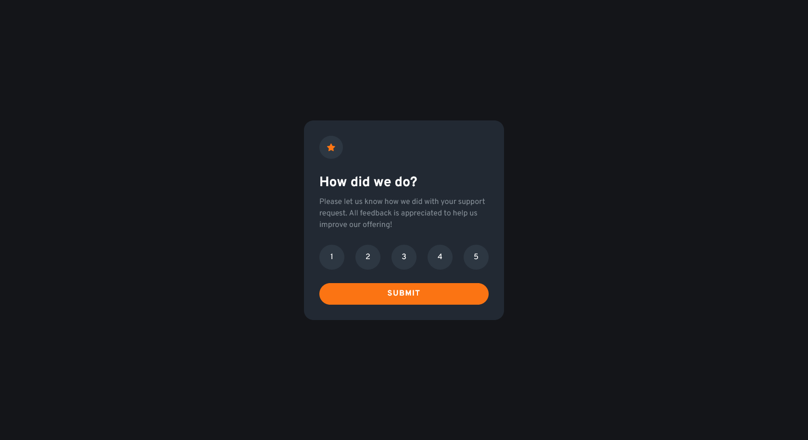

# Frontend Mentor - Interactive rating component solution

This is a solution to the [Interactive rating component challenge on Frontend Mentor](https://www.frontendmentor.io/challenges/interactive-rating-component-koxpeBUmI). Frontend Mentor challenges help you improve your coding skills by building realistic projects. 

## Table of contents

- [Overview](#overview)
  - [The challenge](#the-challenge)
  - [Screenshots](#screenshots)
  - [Links](#links)
- [My process](#my-process)
  - [Built with](#built-with)
  - [What I learned](#what-i-learned)
  - [Continued development](#continued-development)
  - [Useful resources](#useful-resources)
- [Author](#author)

## Overview

### The challenge

Users should be able to:

- View the optimal layout for the app depending on their device's screen size
- See hover states for all interactive elements on the page
- Select and submit a number rating
- See the "Thank you" card state after submitting a rating

### Screenshots

### Links

- Live Site URL: (https://keromaaa.github.io/interactive-rating-component-main/)

## My process

### Built with

- Semantic HTML5 markup
- CSS custom properties
- Flexbox
- [React](https://reactjs.org/) - JS library

### What I learned

As this is my first project on frontendmentor.io, I've chosen a simple project to see how well can I apply everything I have learned up to this point.

### Continued development

In my future projects, I will try to build more complex web-sites with more layers to them. For example more dynamic sites that use React hooks. Once I feel like I've progressed enough, I want to start learning Typescript so I can implement it with React for a more pleasant and transparent coding experience.

### Useful resources

- [HTML/CSS tips](https://www.youtube.com/@KevinPowell) - Great channel with really useful tips and guides for writing better, simpler and more accessible HTML/CSS.
- [Scrimba React course](https://scrimba.com/) - Amazing, easy to understand and interactive course for React.

## Author

- Frontend Mentor - [@keromaaa](https://www.frontendmentor.io/profile/keromaaa)
- LinkedIn - [@keromaaa](https://www.linkedin.com/in/kerim-brki%C4%87-7a4ab3261)